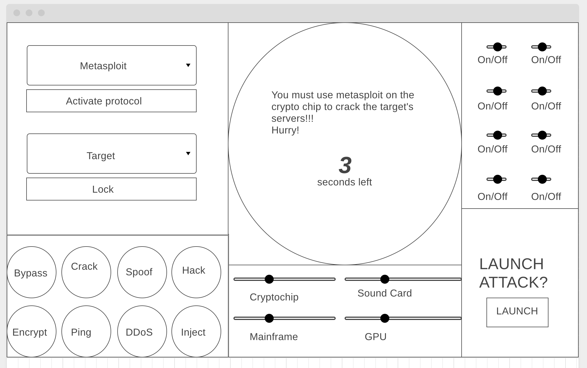
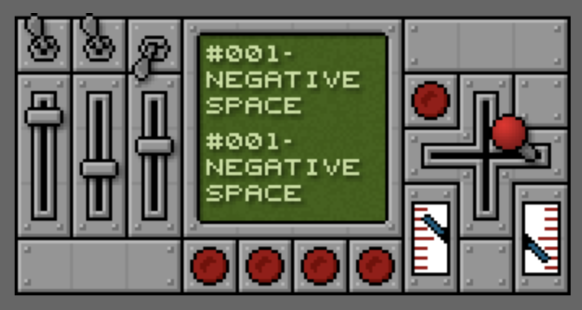
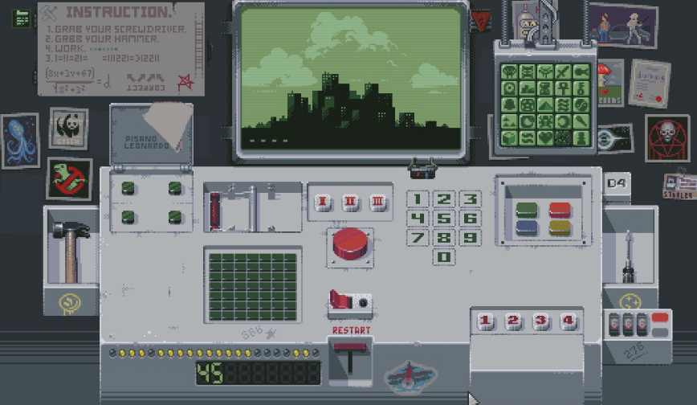

# Mystery Machine - User Stories
---
The player is standing infront of a mystery machine with many knobs, sliders, buttons, switches, dials, etc. There is a pale green screen in the center of the machine with confusing and complicated sequence of instructions describing how to use the machine. Each command also has a timer below it that ticks down every second, and it resets every sequence.  The player wins when they have completed 5 sequences. The player loses if the timer ever runs out, or if they guess incorrectly three times. 

## Visual Style
[Mechanic #020 - Control Panel by Sean Howard](http://squidi.net/three/entry.php?id=20)
The game will have the look and feel of early video games with 8/16-bit colors with limited pallettes. Each button, knob, slider, etc will play a sound when activated. The fonts will be pixelated and the screen will be monochrome green.

## Gameplay 

The game will essentially play like simon says in the visual style of [Please, Don't Touch Anything](https://fourquarters.itch.io/pdta-ld). There will be a prompt on the screen, and the player inputs the sequence in order to progress. The instructions will be a little less intuitive, and the timer will be tuned to make sure that the player is under pressure to figure out the sequence to progress. The sequences will get longer and potentially more complicated as the player progresses. The player will enter what they think the sequence is, then press launch to guess, then if they are correct the game will progress, if they are incorrect they lose a life. If the player loses three lives, or doesn't enter the sequence in the alotted time then the game is over. 

## How it works 
It's basically one big UI. I'll have arrays containing all elements of each type, and be able to randomly/procedurally pick the sequence and display it on the screen. The game will then wait for the user to configure the machine the way they think it needs to be configured, then hit launch, which is when the game will check to make sure the inputs are configured according to the sequence. At the very end, if the player beats the game, I want a piece of toast to come up from the top of the machine, implying that this isn't some crazy hacker machine, and is actually a toaster. 

## Sound Reference 

[Dew Point by Chris Christodoulou for the Risk of Rain OST](https://www.youtube.com/watch?v=TVyBV_HC8eg)

[Apex Beat by Darren Korb of the Transistor OST](https://www.youtube.com/watch?v=y4o8zJGNFNo)

[Wanna Fight by Cliff Martinez for Only God Forgives](https://www.youtube.com/watch?v=JRHMJ_zzjnA)
